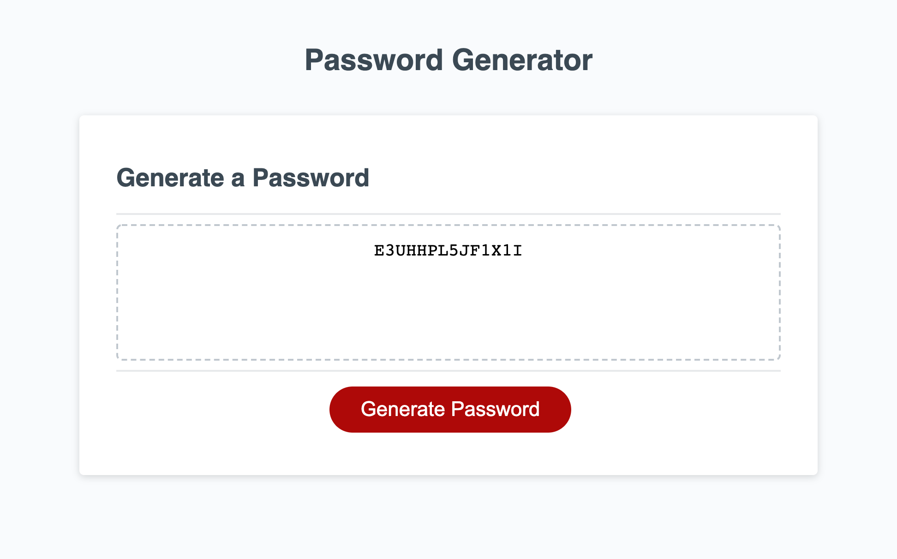
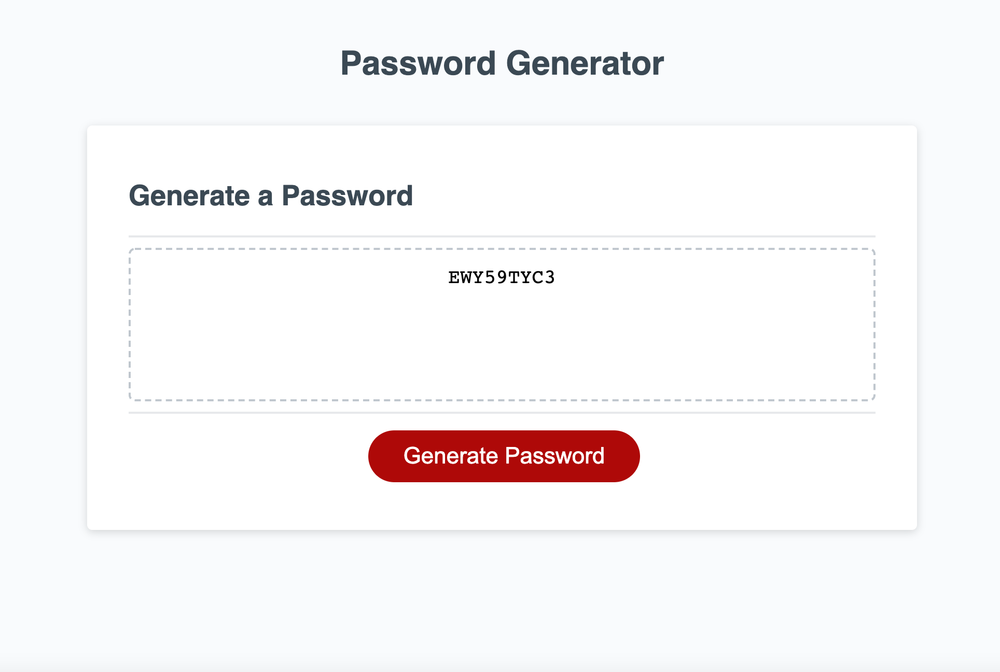

#Password-Generator 

The purpose of this Assignment was to vreate a high functioning Password GEnerator. This Password Generator would do the following

* Ask the user if the amount of characters they wanted in their password spanning from 8-128

* Ask the user if they wante special characters for their password
* Ask the user if they wanted capitol letters for their password
* Ask the user if they wante lower case letters for thei password
* And lastly ask the user if they wanted numbers for their password 

Below is a screenshot of the website before being asked to generate a password

Below is a screenshot of the website after succefully completing the task of generaing a password with capital letters and numbers!

